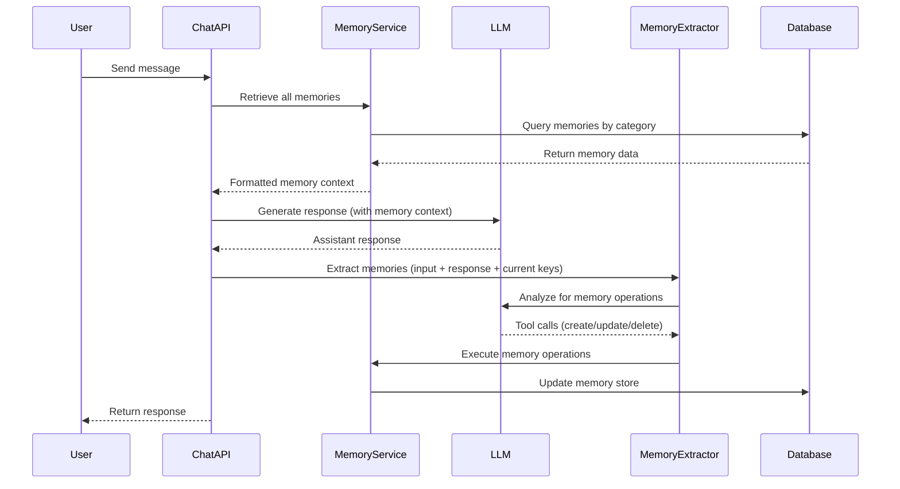

# Design Document

## Overview

The Memory Feedback Cycle system implements a continuous loop where conversations drive memory updates and memories inform future conversations. The architecture follows a pipeline approach: Memory Retrieval → Response Generation → Memory Extraction → Memory Updates → State Refresh.

## Architecture

### High-Level Flow



### System Components

1. **Chat API Handler**: Orchestrates the complete feedback cycle
2. **Memory Service**: Manages memory CRUD operations and formatting
3. **Memory Extractor**: Analyzes conversations and generates tool calls
4. **LLM Interface**: Handles both response generation and memory extraction
5. **Memory Database**: Persistent storage for the KV memory store

## Components and Interfaces

### ChatAPI Handler

```python
class ChatHandler:
    async def process_message(self, user_message: str) -> str:
        # 1. Retrieve memories
        memories = await self.memory_service.get_all_memories()
        
        # 2. Generate response with memory context
        response = await self.llm.generate_response(
            user_message, 
            memory_context=memories
        )
        
        # 3. Extract and update memories
        await self.memory_extractor.process_conversation(
            user_message, 
            response, 
            current_memories=memories
        )
        
        return response
```

### Memory Service

```python
class MemoryService:
    async def get_all_memories(self) -> Dict[str, Dict[str, str]]:
        """Retrieve memories organized by category"""
        
    async def format_for_llm(self, memories: Dict) -> str:
        """Format memories for LLM system prompt"""
        
    async def create_memory(self, category: str, key: str, value: str) -> None:
        """Create new memory entry"""
        
    async def update_memory(self, category: str, key: str, value: str) -> None:
        """Update existing memory"""
        
    async def delete_memory(self, category: str, key: str) -> None:
        """Delete memory entry"""
```

### Memory Extractor

```python
class MemoryExtractor:
    async def process_conversation(
        self, 
        user_input: str, 
        assistant_response: str, 
        current_memories: Dict
    ) -> None:
        """Analyze conversation and execute memory operations"""
        
    def _get_tool_definitions(self) -> List[Dict]:
        """Define memory management tools for LLM"""
        
    async def _execute_tool_call(self, tool_call: Dict) -> None:
        """Execute memory operation tool calls"""
```

## Data Models

### Memory Structure

```python
@dataclass
class Memory:
    id: str
    category: MemoryCategory  # identity, principles, focus, signals
    key: str
    value: str
    created_at: datetime
    updated_at: datetime

class MemoryCategory(Enum):
    IDENTITY = "identity"
    PRINCIPLES = "principles" 
    FOCUS = "focus"
    SIGNALS = "signals"
```

### Memory Context Format

```python
# Format for LLM system prompt
memory_context = """
## Your Current Memories

### Identity
- name: Claude
- role: AI assistant focused on helpful conversations

### Principles  
- honesty: Always provide truthful information
- helpfulness: Prioritize being useful to users

### Focus
- current_project: Memory system development
- learning_goal: Understanding user preferences

### Signals
- user_prefers: Direct communication style
- conversation_tone: Professional but friendly
"""
```

## Error Handling

### Graceful Degradation Strategy

1. **Memory Retrieval Failure**: Continue with normal chat, log error
2. **Memory Extraction Failure**: Skip memory updates, maintain conversation
3. **Tool Call Execution Failure**: Log error, don't interrupt chat flow
4. **Database Connection Issues**: Use in-memory fallback for session

### Error Recovery

```python
class MemoryFeedbackCycle:
    async def safe_execute(self, operation: Callable) -> Optional[Any]:
        try:
            return await operation()
        except Exception as e:
            logger.error(f"Memory operation failed: {e}")
            return None
```

## Testing Strategy

### Unit Tests
- Memory Service CRUD operations
- Memory Extractor tool call generation
- LLM response formatting with memory context
- Error handling and graceful degradation

### Integration Tests
- Complete feedback cycle flow
- Memory consistency across conversation turns
- Tool call execution and database updates
- Memory quality validation

### End-to-End Tests
- Multi-turn conversations with memory evolution
- Memory persistence across sessions
- Performance under concurrent users
- Memory extraction accuracy

## Performance Considerations

### Optimization Strategies

1. **Memory Caching**: Cache frequently accessed memories in Redis
2. **Batch Operations**: Group multiple memory updates in single transaction
3. **Async Processing**: Non-blocking memory extraction pipeline
4. **Connection Pooling**: Efficient database connection management

### Monitoring

- Memory operation latency
- Tool call success rates
- Memory store growth patterns
- Conversation processing time

## Security Considerations

### Data Protection
- Encrypt sensitive memory values at rest
- Sanitize memory content before storage
- Implement memory retention policies
- Audit trail for memory modifications

### Access Control
- User-scoped memory isolation
- Rate limiting on memory operations
- Validation of tool call parameters
- Prevention of memory injection attacks